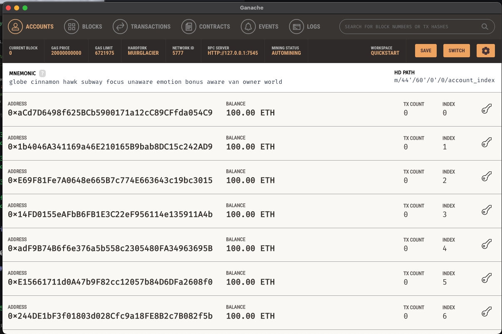
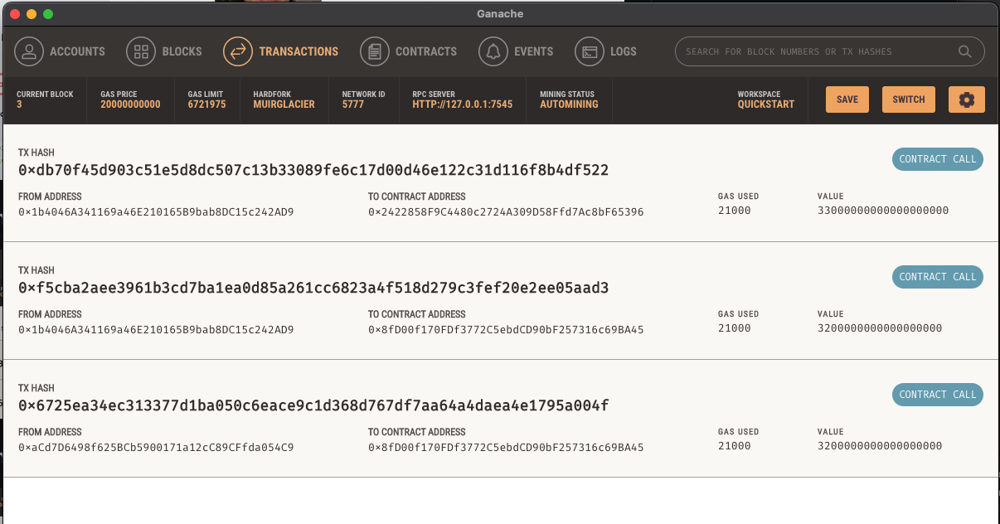

# Fintech Professional Finder System and Instantaneous payment through Ethereum blockchain network.

Fintech Finder streamlit application is built for customers find fintech professionals among a list of candidates, hire them, and pay them
by integrating with Ethereum blockchain network in order to enable instant pay with cryptocurrency.

**1) A new Ethereum account instance by using the mnemonic seed phrase provided by Ganache.**

**2) Fetch and display of account balance associated with Ethereum account address.**

**3) Pay a Fintech findet candidate by calculating the total value of an Ethereum transaction, including the gas estimate.**

**4) Digitally sign the payment transaction and send this to Ganache blockchain.**

**5) Transaction hash code review associate with the validated blockchain transaction.**

-----------------------------------------------------------------------

### Demonstration of Fintech Finder application with the integrated Ethereum wallet.

https://user-images.githubusercontent.com/99471693/178936180-9581e139-5c4f-40f5-b87d-71543c07c0d1.mp4

